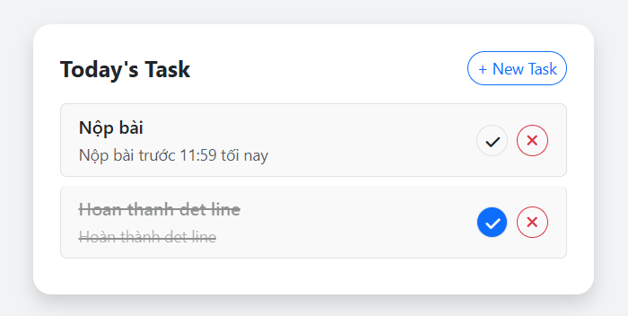

# Simple todo app

Đây là một Todo app đơn giản có chức năng thêm công việc và mô tả công việc, dữ liệu được lưu trong local storage với key là todos

# Preview

  

# Thêm task mới

Form nhập công việc mới hiển thị khi click vào nút + New task, cho phép nhập tên công việc và mô tả công việc

  

# Hoàn thành/Xóa task 
Khi bấm hoàn thành, công việc sẽ mờ đi và có thêm một gạch ngang biểu thị công việc đã được hoàn thành

  

